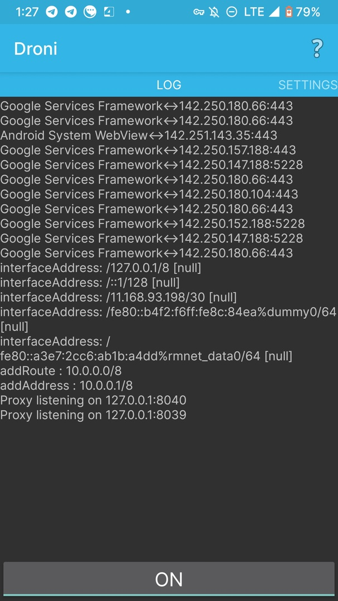
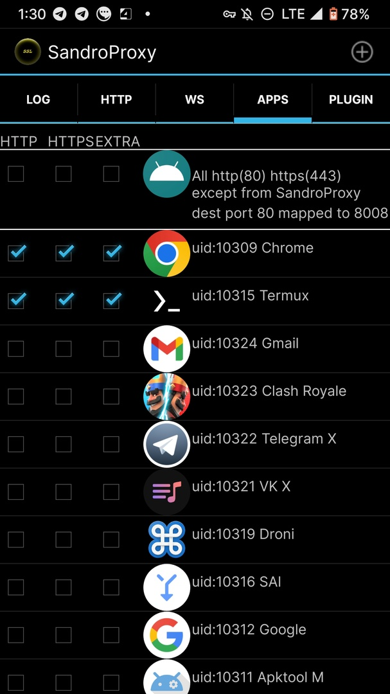
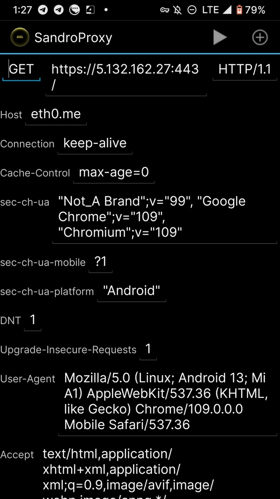
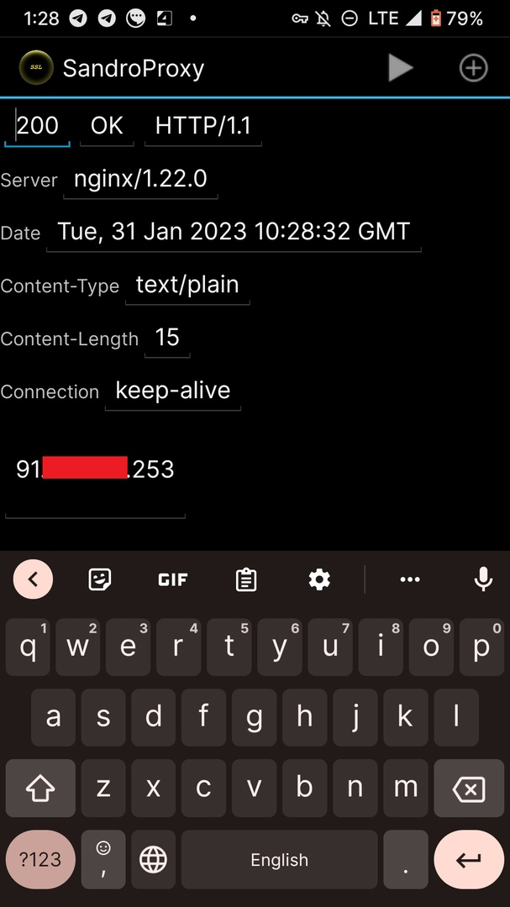
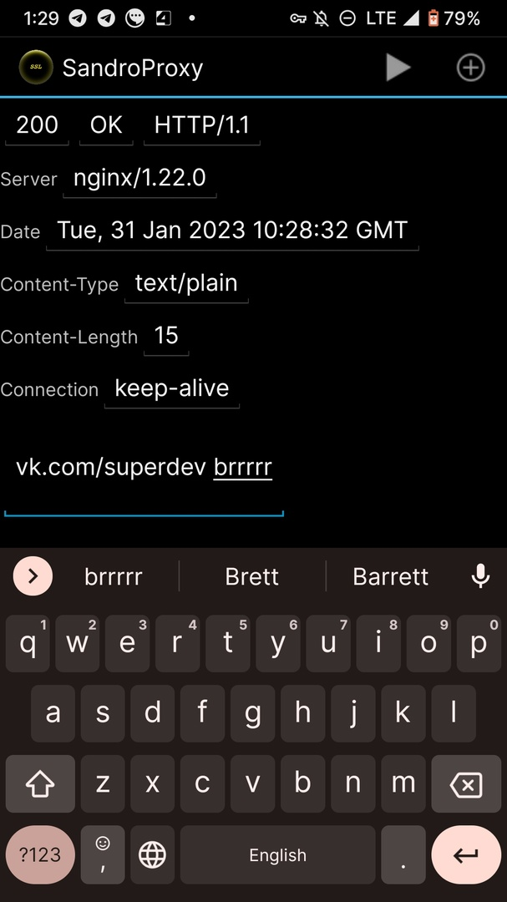
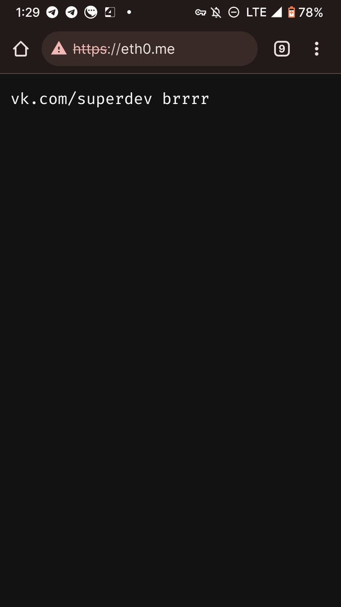

<!-- truncate -->
## Вступление
:::info
Статья перенесена на сайт difhel.dev 21 декабря 2023 года с внесением незначительных изменений.

Смотреть оригинальную статью в веб-архиве - [https://vk.com/@superdev-mobile-traffic-interception](https://web.archive.org/web/20231221120444/https://vk.com/@superdev-mobile-traffic-interception)
:::
Если вы так же, как и я редко бываете дома и часто не имеете доступа к ноутбуку с Charles Proxy / Burp Suite, то эта статья для вас.

Тут - о том, как перехватывать (и, конечно, изменять) HTTP/HTTPS трафик, имея доступ только к телефону.

## Нам понадобится
- Android-телефон с root-правами
- прокси Drony (https://play.google.com/store/apps/details?id=org.sandrob.drony&hl=ru&gl=US)
- прокси SandroProxy (последняя версия от 2016 года - https://m.apkpure.com/ru/sandroproxy/org.sandroproxy, ветка на XDA - https://forum.xda-developers.com/t/tool-http-https-analyzer-sandroproxy.1737138/page-9)
- ~~идеально прямые руки~~

Магическое приложение (aka чарлик мобайл) - это и есть SandroProxy. Программа была создана в 2012 и не обновлялась с 2016 года. Тем не менее, мне удалось ее запустить в 2023 на Android 13, хотя некоторые фичи не работают.

## Начинаем магию!
Для начала выдаем разрешения SandroProxy, далее нужно предоставить root-права. Для удобства можно в Magisk временно включить автоматическое предоставление прав при запросе.

Программа встречает нас современным интерфейсом в стиле последней версии Material Design 3 /s

import { Carousel } from './../../src/components/Carousel';
import screenshot1 from './screenshot1.jpg';
import screenshot2 from './screenshot2.jpg';
import screenshot3 from './screenshot3.jpg';
import screenshot4 from './screenshot4.jpg';
import screenshot5 from './screenshot5.jpg';
import screenshot6 from './screenshot6.jpg';
import screenshot7 from './screenshot7.jpg';
import 'react-slideshow-image/dist/styles.css'

<Carousel slideImages ={[
  {
    url: screenshot1,
    caption: '1. Выбираем режим Plain proxy, выделенный режим помечается звездочкой (вообще нам нужен developers mode, но у меня с ним возникло много проблем).'
  },
  {
    url: screenshot2,
    caption: '2. Заходим в настройки и ставим галочки Capture Data и Transparent proxy.'
  },
  {
    url: screenshot3,
    caption: '3. Перезапускаем прокси (2 раза кликаем на кнопку паузы) и убеждаемся, что появилась надпись «Proxy listening on 127.0.0.1:8008». Это означает, что SandroProxy слушает порт 8008 и отображает информацию обо всех входящих запросах (примерно по такой же схеме работает Charles Proxy).'
  },
]}/>

 
Далее нужно настроить систему для перенаправления всего трафика на localhost:8008. Есть вариант подключиться к WiFi и использовать прокси. Но у меня это не заработало.

Поэтому нам нужен оберточный прокси Drony. В нем нужно настроить перенаправление всего трафика системы на localhost:8008. Для этого Drony будет использовать VPN-соединение.

<Carousel slideImages ={[
  {
    url: screenshot4,
    caption: '1. Интерфейс Drony. Не включаем прокси до настройки!'
  },
  {
    url: screenshot5,
    caption: '2. В настройках меняем порт прокси на 8040 (или любой другой, но не дефолтный 8020). Это нужно, поскольку SandroProxy тоже использует порт 8020 для отображения панели типа devtools (ага, на localhost:8020 можно будет рассматривать все свои запросы).'
  }
]}/>
 

Далее выбираем тип соединения с интернетом - WiFi или другое (например, мобильный интернет). 

<Carousel slideImages ={[
  {
    url: screenshot6,
    caption: '1. Выбираем Hostname localhost и порт 8008, proxy type - manual'
  },
  {
    url: screenshot7,
    caption: '2. Выбираем Hostname localhost и порт 8008, proxy type - manual'
  }
]}/>
 

Выбираем Hostname localhost и порт 8008, proxy type - manual.

Если мы сейчас запустим Drony, то произойдет примерно следующее.

1. SandroProxy ловит запрос и отправляет его на заданный сервер.
2. Поскольку запрос исходит с телефона, он проходит по VPN-соединению Drony.
3. Drony редиректит запрос на localhost:8008.
4. Запрос дублируется.
5. Приложение уходит в вечную рекурсию и падает.

Чтобы остановить такое поведение, надо разрешить в Drony устанавливать прямое соединение для приложения SandroProxy. Таким образом, запросы SandroProxy не будут проксироваться Drony и ошибка возникать не будет.

Для этого на вкладке Settings Drony ищем Filter → Edit filter rules → нажимаем на + → выставляем значения Network ID: all networks, Action: Direct, Application: выбираем SandroProxy в списке. Все остальные поля оставляем пустыми и сохраняем. После этого перезапускаем Drony.

## Сама магия
Далее включаем Drony и смотрим, чтобы в логе не было ошибок. **SandroProxy уже должен быть включен.**

Если в логах есть что-то такое:

> VK Messenger < - > 87.240.137.130:443
>
> ConnectionHandler got an error:
>
> java.net.ConnectException: failed to connect to localhost/127.0.0.1 (port 8008) > from /127.0.0.1 (port 48495)
>
> after 30000ms: isConnected failed: ECONNREFUSED
>
> (Connection refused)

Значит, не удается соединиться с SandroProxy, и стоит копать в эту сторону. Такая ошибка может возникать, если сначала был включен Drony, а потом - SandroProxy, поэтому запускать их надо в обратном порядке.

Теперь возвращаемся в SandroProxy.

## Как создать breakpoints
В приложении есть такая вкладка, как Apps - местный аналог breakpoint'ов. Оно ловит соединения (можно настроить http/https/extra) у заданных приложений. Советую выбирать только нужные приложения, если не хотите вручную обрабатывать кучу фоновых запросов от системы (ну а если вам не лень, то смело ставьте галочки в All).

Для примера будем ломать сайт https://eth0.me - сайт показывает IP-адрес клиента.

Будем перехватывать запросы из Chrome. Выбираем приложение и ставим нужные галочки.

Теперь идем в Chrome и открываем тестовый сайт. Для примера я буду использовать https://eth0.me - сайт возвращает IP-адрес клиента plaintext'ом. Если сделали все правильно, сайт зависнет (так же, как и в Charles), пока вы не пропустите запрос вручную.

Вот так выглядит окно request'а:

Вот так - окно response'а:

Заменим текст на наш собственный.

Сохраним response (и еще пропустить запрос favicon.ico, чтобы страница запустилась), и - вуаля!

---
## Вместо заключения
Понятно, что такой инструмент не позволит полностью обойтись без Charles при тестировании безопасности веб-сервисов. Однако это точно поможет быстро проверить запросы/ответы к серверу и провести минимальные проверки, находясь в любой точке мира без компьютера. 

