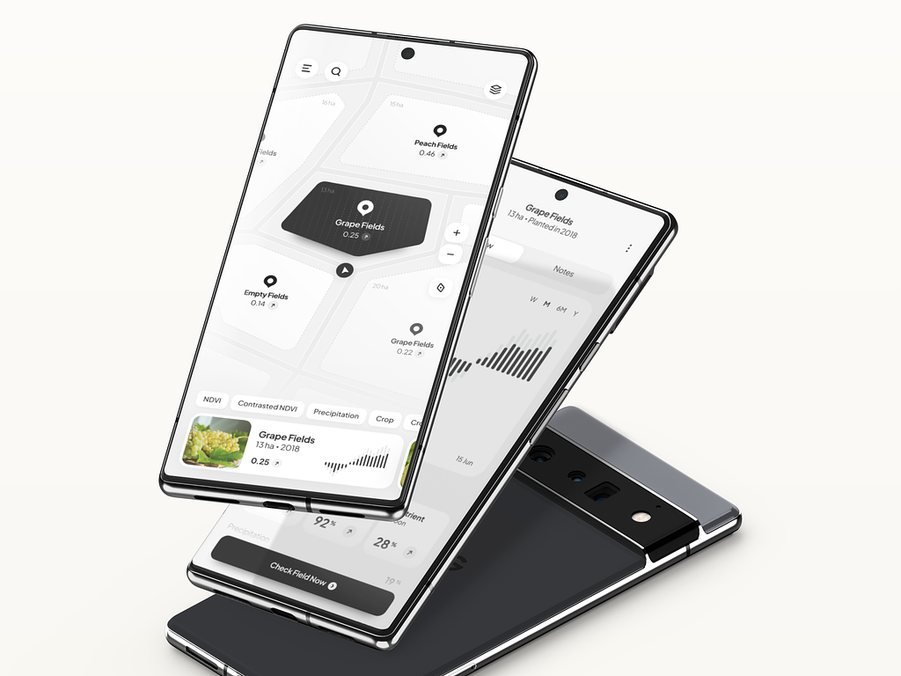
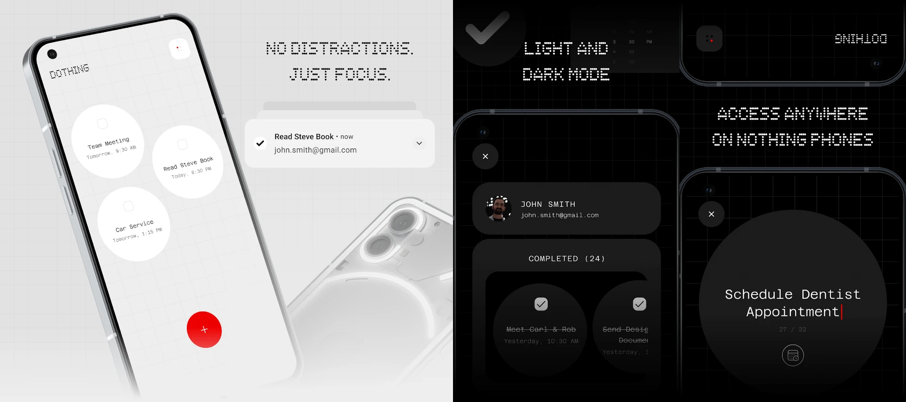
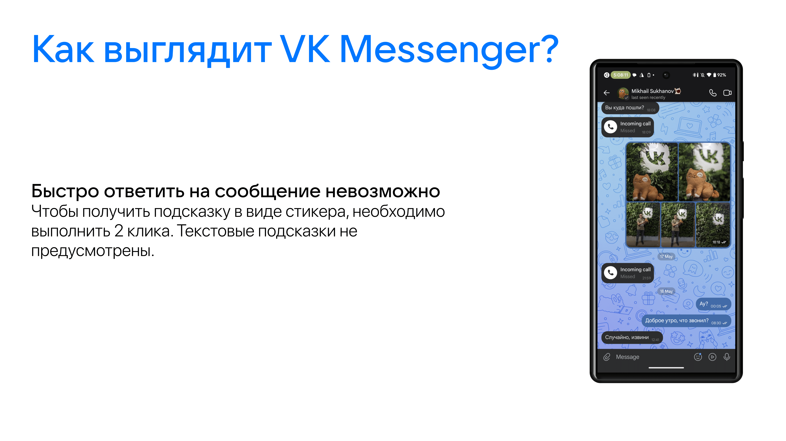
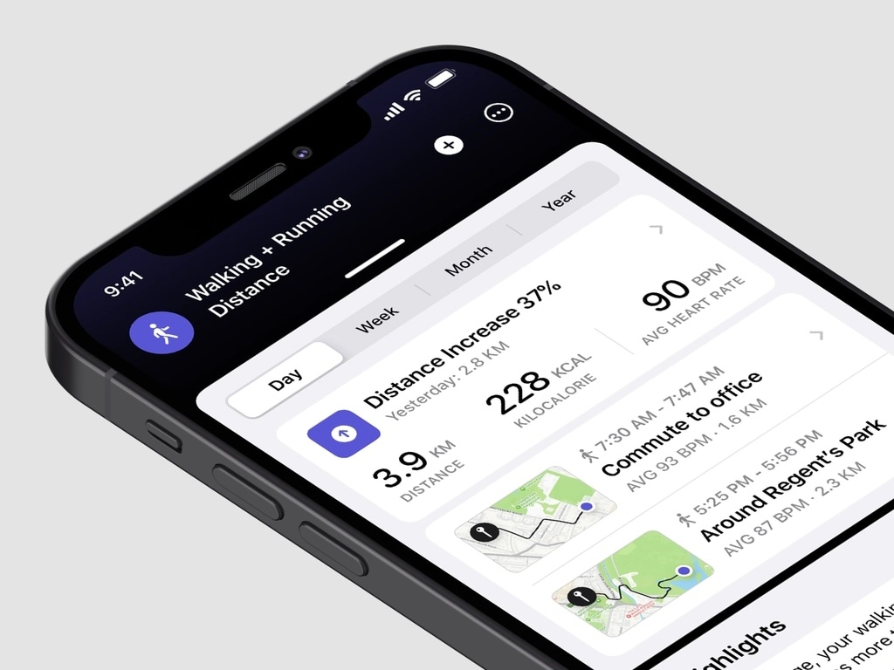
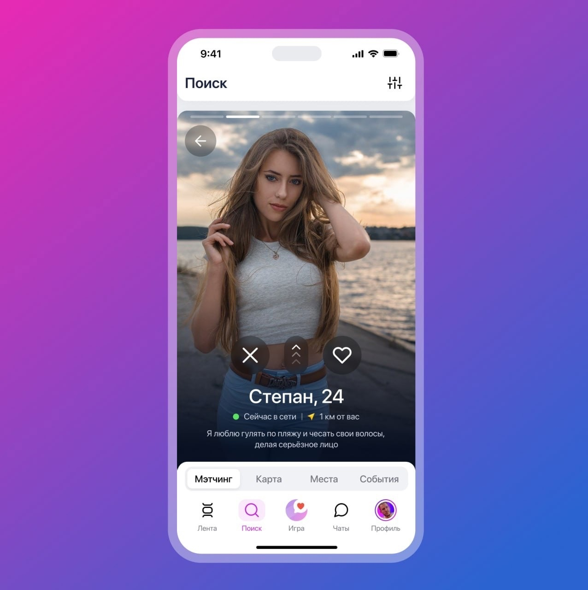

<!-- truncate -->
## Кто такие ваши мокапы и зачем они нужны

<figure>

<figcaption>
Он нам и даром не нужен, этот ваш мокап!
</figcaption>
</figure>

Немного моих наблюдений про мокапы со смартфонами.

Большинство идей для этого поста взято из моего личного опыта, но что-то было взято из сообщества [VK Designers](https://vk.com/vkdesigners).

**Мокап** — это модель объекта, с помощью которой можно наглядно продемонстрировать дизайн чего-либо (правда, тут мы говорим только о приложениях) и до производства (разработки) оценить, как продукт будет выглядеть в реальности.

В случае с приложениями, мокап представляет собой изображение смартфона, в котором открыто презентуемое приложение.

<figure>

<figcaption>
Пример мокапа
</figcaption>
</figure>

:::note
Мокапы - быстрый и эффективный способ презентовать идею заказчику.
:::

## Требования к мокапам

**Мокапы должны быть убедительными.** Помните, ваша задача - подготовить иллюстрацию, которая покажет заказчику или клиенту, как внедрение вашего продукта улучшит его опыт. Отсюда вытекает еще один критерий - **реалистичность**. Если вы используете некачественный мокап, в котором скриншот приложения обрезается, перекрывает границы экрана или растянут - в общем, если с первого взгляда мокап похож на кривой фотошоп, а не на реальный фотоснимок вашего продукта, его вряд ли можно назвать убедительным.

Чуть более подробно про реалистичность:
- Обращайте внимание на блики, отражения и тени.
На хорошем мокапе они обязательно будут в правильных местах. Если для реалистичности нужно добавить блики, это можно сделать в Photoshop или Figma. Также стоит добавлять тени (мне нравится концепция [Material Design](https://m3.material.io/styles/elevation/overview) касательно использования теней для того, чтобы передать объем и расстояние между объектами мокапа по оси Z)
- Среди шаблонов мокапов (о которых, кстати, есть пару слов ниже) довольно много шаблонов, в которых искусственность 3D-графики бросается в глаза. Из-за отсутствия внимания к деталям они не похожи на фотоснимок. Перенести дизайн на такое изображение можно, но результат будет недостаточно убедителен, поскольку дизайн будет показан не в реальной, а полностью цифровой среде. Лучше отложить такой мокап и попробовать найти более реалистичное изображение.

<figure>

<figcaption>
Пример слишком искусственной (нереалистичной) графики - особенно если посмотреть на задний блок камер
</figcaption>
</figure>

## Устройство
Еще стоит обратить внимание на устройство, на основе которого вы делаете мокап. Здесь нужно найти грань между убедительностью и естественностью.

Иногда вы разрабатываете проект под специфический набор устройств, и понятно, что именно эти устройства должны быть использованы в мокапах. Например, недавно [вышел таск-трекер Dothing](https://rozetked.me/news/32522-v-google-play-poyavilsya-task-treker-v-stilistike-nothing) специально для Nothing Phone. Очевидно, что для презентации этого продукта вряд ли подойдет iPhone - в подобных кейсах используем специфические устройства, чтобы не совершать прям совсем смешные ляпы.

<figure>

<figcaption>
Если ваш проект ориентируется на специфические устройства, их и нужно использовать в мокапах
</figcaption>
</figure>

Но как выбрать устройство для мокапа в общем случае? В своем выпускном проекте в Samsung я [экспериментировал](https://gg.gg/vkgpt2) с Google Pixel 6, мне в принципе понравился результат. В общем, если ваше приложение заточено под Android, использование флагманских устройств Google - идеальный вариант.

<figure>

<figcaption>
Довольно реалистичный и красивый мокап устройства Google, по внешнему дизайну (с передней стороны) ставший де-факто стандартом для устройств на Android
</figcaption>
</figure>

А еще в общем случае можно использовать последние версии iPhone - их внешний дизайн, возможно, довольно заезжен, но точно будет выглядеть дорого и убедительно.

<figure>

<figcaption>
Красота!
</figcaption>
</figure>

## А можно совсем без устройства?
Да! Если вы не хотите акцентировать внимание на специфическом устройстве (например, у вас мультиплатформенное приложение, сайт или миниап), можно полностью избавиться от устройства, а вместо него использовать полупрозрачные рамки. Например:

Выглядит минималистично, красиво и не привлекает лишнего внимания к устройству.

Еще можно полупрозрачные рамки заменить на тени (эта идея взята из дизайн-концепта Миши Суханова):

## Где брать готовые мокапы
В 99.5% случаев вам не нужны какие-то редкие специфические объекты для презентации, а значит, что вы можете сэкономить время и использовать готовые шаблоны. Их можно найти (по убыванию удобства для дизайнеров):
- во вкладке Community в Figma
- используя специальные плагины в Figma:
    - плагин для красивого поворота изображения в 3D: [3D Transformer](https://www.figma.com/community/plugin/1009780509659307229/3d-transformer)
    - плагин, позволяющий выбрать разные устройства от iPhone 15 Pro Max до Google Pixel 8 Pro: [iMockup](https://www.figma.com/community/plugin/1305891870034170272/imockup)
    - [Rotato 3D Mockups](https://www.figma.com/community/plugin/1009741687635558607/rotato-3d-mockups-explosions) (конкретно этот не использовал лично)
    - [Wireframer](https://www.figma.com/community/plugin/787660853629435276/wireframer) для генерации красивых плейсхолдеров для текста (напоминает спойлеры в Telegram)
- используя известные каждому дизайнеру [behance.net](https://www.behance.net/) и [Dribbble](https://dribbble.com/)
