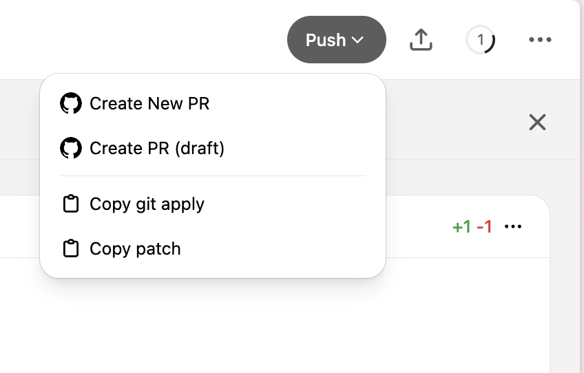
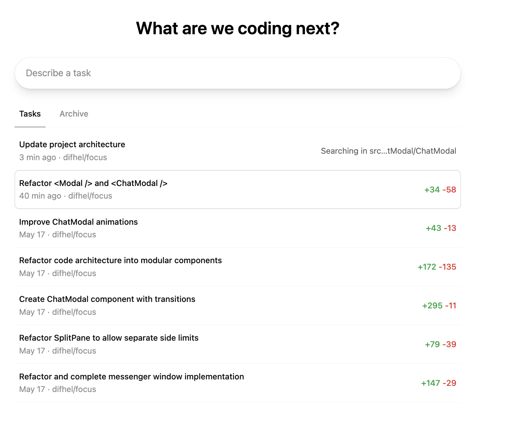

<!-- truncate -->
Впечатления очень неоднозначные.

Прежде чем продолжить, должен отметить, у него есть

## Сильные стороны
- Codex можно запустить прямо с телефона, благодаря тому, что ВСË в облаке. Достаточно всего лишь выдать доступ к GitHub и написать, что ты хочешь сделать.

import { Carousel } from './../../src/components/Carousel';
import screenshot1 from './screenshot1.png'
import 'react-slideshow-image/dist/styles.css'

<Carousel slideImages ={[
  {
    url: screenshot1,
    caption: 'Само по себе думает. Можно закрыть страницу и не беспокоиться'
  }
]}/>

- Он позволяет сразу же создать PR (или Draft PR) на GitHub, или, что лично мне удобнее — скопировать `git apply` команду, которую достаточно просто вставить в терминал и увидеть изменения от GPT в своей IDE. То есть тут нет привязки к Cursor/ChatGPT Desktop App/любому другому приложению, что однозначно плюс.

- можно параллельно оставить его работать над разными задачами

На этом плюсы, собственно, заканчиваются. 

## Чем я недоволен
Что по минусам:

- работает очень долго, сильно дольше того же Cursor с любыми моделями. Один раз даже было, что оно думало 4 минуты, а после этого вместо кода только выдало план, что оно хочет сделать (!!!).

import screenshot4 from './screenshot4.png'
import tinkov from './tinkov.png'

<Carousel slideImages ={[
  {
    url: screenshot4,
    caption: ''
  },
  {
    url: tinkov,
    caption: 'My honest reaction'
  }
]}/>

- самое критичное для меня: оно запускает проект **в окружении без доступа к интернету!** Обычно я прошу модель после любых изменений прогонять линтер и фиксить ошибки, но здесь это невозможно, так как банальный `npm install` работать не будет.
:::note
UPD: по состоянию на 24.08.2025, интернет в окружении появился, хотя в ранней версии Codex, на которую я писал обзор, его не было.
:::
- несмотря на то, что работа с контекстом гораздо лучше, чем в Cursor, ИИ все еще крайне посредственно справляется (читай — никак не решает) с исправлениями ошибок в коде.

Получается классический write-only код, который после некоторой отметки (которая достигается обычно быстро) больше не подлежит работе с ИИ из-за ограничений контекста моделей и того, что разработчику приходится дебажить и разбираться в том, что накурсорил ИИ.

Еще, наверно, можно отметить, что Codex доступен только в подписке ChatGPT Pro. Я не выношу это как минус. Ну увы, доступ к серьезным вычислительным мощностям для передовых технологий (коей, разумеется, Codex является) никогда не будет дешевым.

Не хочу сказать, что ИИ для разработки это бесполезная хрень. Например, мне бывает полезно скормить всю кодовую базу в модель с большим контекстом и спросить, как тут делается что-то конкретное (например, подсмотреть реализацию какой-то фичи из опенсорсного проекта или быстро найти место, куда нужно вручную внести правки). Но почему-то в основном ИИ популярно рассматривать как инструмент для написания кода, и для этой роли он пока подходит очень плохо. Впрочем, Codex - хороший шаг вперед, чтобы это исправить.
