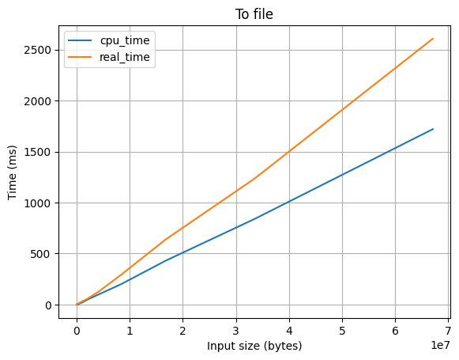
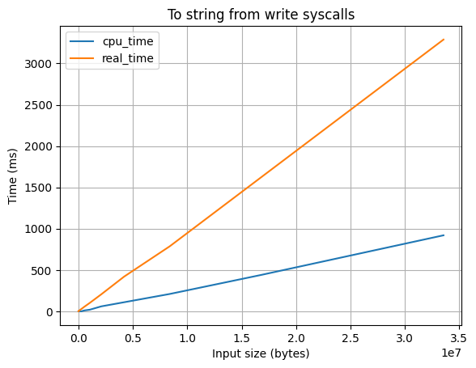
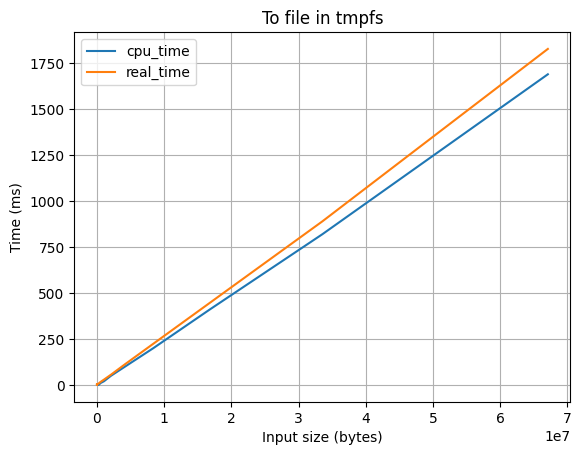
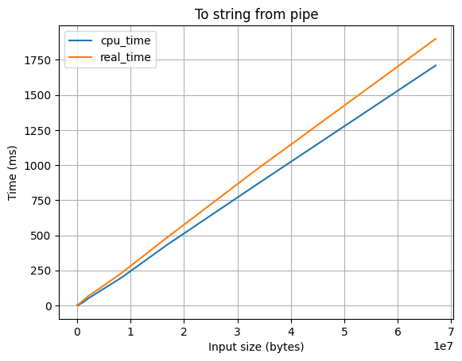
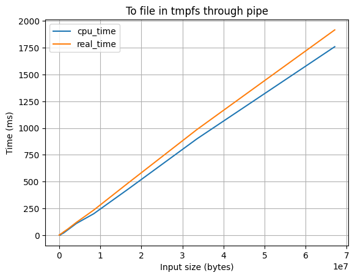
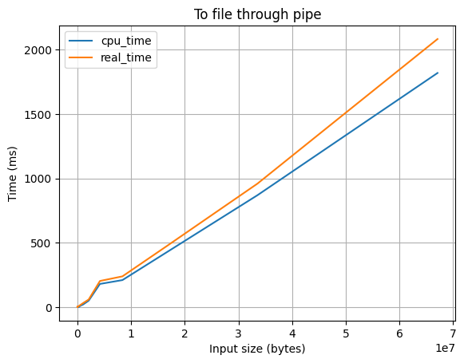
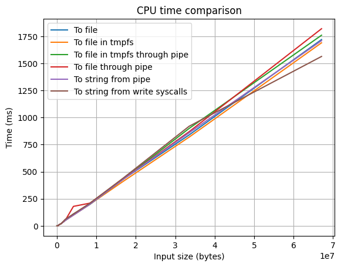
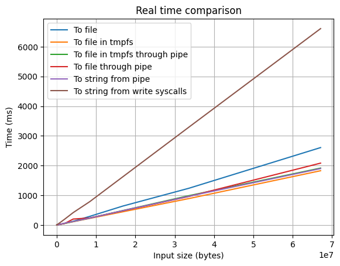

В этой статье мы, [разработчики Elan](https://t.me/elan_judge), рассмотрим различные методы захвата вывода процесса в тестирующей системе Elan и сравним их производительность.

<!-- truncate -->

В тестирующей системе есть отдельная подсистема, которая выполняет запуск процесса в изолированной среде. Она применяет некоторые ограничения для безопасности (например, ограничения потребления памяти и времени выполнения, контроль запускаемых процессом системных вызовов и многое другое). Мы называем ее **runner engine**. Runner также умеет передавать данные в stdin процесса и захватывать вывод в stdout (стандартном потоке вывода) и stderr (стандартном потоке вывода информации об ошибках).

import { Carousel } from './../../src/components/Carousel';
import slide1 from './slide1.png';
import slide2 from './slide2.png';
import slide3 from './slide3.png';
import 'react-slideshow-image/dist/styles.css'


<Carousel slideImages ={[
  {
    url: slide1,
    caption: 'Отрывок презентации про runner engine из доклада команды разработчиков Elan (листайте)'
  },
  {
    url: slide2,
    caption: 'Что такое runner engine'
  },
  {
    url: slide3,
    caption: 'Как runner запускает процесс и отслеживает его состояние в нескольких потоках'
  },
]}/>

Подробнее о тестирующей системе и о runner engine можно прочитать в [одном из наших докладов](http://gg.gg/elan_j), а в этой статье мы разберем различные способы захвата вывода процесса в поток, сравним их производительность и рассмотрим их особенности.

## Словарь
Для начала определимся с двумя основными механизмами ОС, которые мы используем для захвата вывода.
- `tmpfs` - файловая система, предназначенная для использования как временное хранилище во многих Unix-подобных ОС. [Tmpfs](https://www.kernel.org/doc/html/latest/filesystems/tmpfs.html) можно примонтировать как обычную файловую систему, но размещается она в ОЗУ, а не на физическом диске, что дает большой прирост к скорости чтения и записи.
- `pipe` - [механизм](https://man7.org/linux/man-pages/man2/pipe.2.html) межпроцессного взаимодействия, который позволяет передавать данные между процессами в одну сторону.

## Методика оценки
### Замер скорости захвата вывода в runner
Программа, на запуске которой мы тестировали скорость захвата вывода, выглядит так:
```cpp
#pragma GCC optimize("O0")
#include <iostream>
int main() {
    int i;
    std::cin >> i;
    while (--i) {
        std::cout << 0;
    }
}
```
Как видно, она принимает число `i` и генерирует выходной поток из `i` байт (`i` раз повторенного символа "0").

С помощью прагмы мы также отключаем все оптимизации компилятора, чтобы статистика была максимально точной.

Чтобы оценить скорость различных методов захвата вывода, мы запускали эту программу с различными значениями `i` (степени двойки от 1 до 2^26≈6.7e7) с помощью runner и сохраняли значения real time и CPU time.
### Устройство, на котором замеряли
Тестирование проводилось на ноутбуке Lenovo ThinkPad 15 Gen1 с такими характеристиками:
- процессор Intel Core i7-1065g7
- 32gb ОЗУ
- диск HDD WDC WD5000LPVX-75V0TT0
- OS - Manjaro Linux

## Основные методы захвата вывода
- **Вывод в обычный файл** - average 1'200 ms (CPU time), 4'300 ms (real time)
- **Вывод в файл в tmpfs** - average 1'200 ms (CPU time), 1'600 ms (real time)
- **Вывод в pipe (с перенаправлением в строку)** - average 1'150 ms (CPU time), 1700 ms (real time)
- **Вывод в pipe (с перенаправлением в файл)** - average 1'200 ms (CPU time), 1650 ms (real time)
- **Вывод в pipe (с перенаправлением в файл в tmpfs)** - average 1'200 ms (CPU time), 1650 ms (real time)
- **Вывод в строку через считывание системных вызовов** - average 1'200 ms (CPU time), 15'000 ms (real time)

Рассмотрим особенности этих методов. Также для каждого метода ниже приведен график зависимости времени выполнения от размера вывода, чтобы можно было оценить стабильность различных методов (спойлер: зависимость почти линейная, они все стабильны).

:::info
Вы можете скачать Jupyter Notebook с кодом и данными для построения графиков [здесь](./assets/plots.ipynb).
:::

### Вывод в обычный файл
При помощи [dup2(2)](https://man7.org/linux/man-pages/man2/dup.2.html) вывод просто перенаправляется в файловый дескриптор, полученный с помощью [open(2)](https://man7.org/linux/man-pages/man2/open.2.html).

Особенности:
- ✅ Не потребляет оперативную память
- ❌ Работает довольно медленно



###  Вывод в строку через считывание системных вызовов
В цикле [ptrace(2)](https://man7.org/linux/man-pages/man2/ptrace.2.html) получаем информацию о том, что процесс вызвал [write(2)](https://man7.org/linux/man-pages/man2/write.2.html) и через PTRACE_PEEKDATA считываем данные. При этом вывод самого процесса перенаправлен в /dev/null.

Особенности:
- ❌ Работает КРАЙНЕ медленно из-за того, что PTRACE_PEEKDATA позволяет считывать данные только по 8 байт



### Вывод в файл в tmpfs
При помощи [dup2(2)](https://man7.org/linux/man-pages/man2/dup.2.html) вывод просто перенаправляется в файловый дескриптор, полученный с помощью [open(2)](https://man7.org/linux/man-pages/man2/open.2.html), но открывается файл, который находится в tmpfs.

Особенности:
- ❌ Потребляет много оперативной памяти
- ✅ Работает быстро



### Вывод в pipe с перенаправлением в строку
При помощи [dup2(2)](https://man7.org/linux/man-pages/man2/dup.2.html) вывод перенаправляется в файловый дескриптор, полученный с помощью [pipe(2)](https://man7.org/linux/man-pages/man2/pipe.2.html), но когда в цикле [ptrace(2)](https://man7.org/linux/man-pages/man2/ptrace.2.html) мы узнаем, что pipe переполнился, то все текущие данные в pipe считываем в строку.

Особенности:
- ✅ Работает достаточно быстро
- ❌ Ест оперативную память
- ❌ Возвращает крайне тяжеловесный объект




### Вывод в pipe с перенаправлением в файл в tmpfs
При помощи [dup2(2)](https://man7.org/linux/man-pages/man2/dup.2.html) вывод перенаправляется в файловый дескриптор, полученный с помощью [pipe(2)](https://man7.org/linux/man-pages/man2/pipe.2.html), но когда в цикле [ptrace(2)](https://man7.org/linux/man-pages/man2/ptrace.2.html) мы узнаем, что pipe переполнился, то все текущие данные в pipe считываем в файл в tmpfs.

Особенности:
- ✅ Работает быстро
- ❌ Ест оперативную память




### Вывод в pipe с перенаправлением в обычный файл
При помощи [dup2(2)](https://man7.org/linux/man-pages/man2/dup.2.html) вывод перенаправляется в файловый дескриптор, полученный с помощью [pipe(2)](https://man7.org/linux/man-pages/man2/pipe.2.html), но когда в цикле [ptrace(2)](https://man7.org/linux/man-pages/man2/ptrace.2.html) мы узнаем, что pipe переполнился, то все текущие данные в pipe считываем в обычный файл, открытый с помощью [open(2)](https://man7.org/linux/man-pages/man2/open.2.html).

Особенности:
- ✅ Работает достаточно быстро
- ✅ Не ест оперативную память




## Графики
Дальше мы решили оценить скорость разных методов захвата относительно друг друга. Так как мы решаем задачу, которую выполняет runner, в рамках тестирующей системы, в которой нужно корректно оценивать время выполнения программы, а в спортивном программировании основное значение имеет процессорное время (а реальное время нужно только для оценки idleness limit, лимита времени простоя), то давайте сравним сначала процессорное время.



Как видно, различные реализации считывания выходных данных почти никак не влияют на процессорное время. Это очень важно, потому что нам нужно обеспечить, чтобы решения, которые проходят лимиты по времени в других тестирующих системах, проходили и в нашей.

В таком случае сравним реальное время:



Тут уже различия существенны. Нужно понимать, что программа в реальности почти никогда не упрется в лимит по реальному времени, так что реальное время всего лишь улучшает или ухудшает скорость тестирования.


## Вывод
- Для классических задач лучше всего использовать вывод в pipe с перенаправлением в файл, потому что он использует для вывода не более 67 Кбайт
- Для интерактивных задач лучшим вариантом будет вывод в файл в tmpfs, потому что он не имеет буфера и позволяет получать вывод процесса в реальном времени

:::info Справка
**Интерактивные задачи** - это задачи, в которых ввод и вывод программы участника соревнования передаются специальной программе-интерактору, которая взаимодействует с программой участника и проверяет корректность ее работы. Например, с помощью интерактивных задач можно создавать задачи на игры. В таком случае участнику надо написать программу, которая делает какие-то ходы, а ответы интерактора на эти ходы зависят от того, как именно сходила программа. Здесь в качестве игр могут выступать не только типичные игры, но и «угадайки». Например: было загадано число от 1 до n. Программа участника пытается его угадать, а интерактивный модуль отвечает больше или меньше загаданное число очередной попытки участника. Требуется отгадать число, сделав не более 2 log2 n попыток. В качестве решения здесь участник может использовать бинарный поиск.
:::
