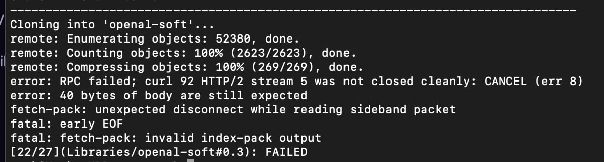
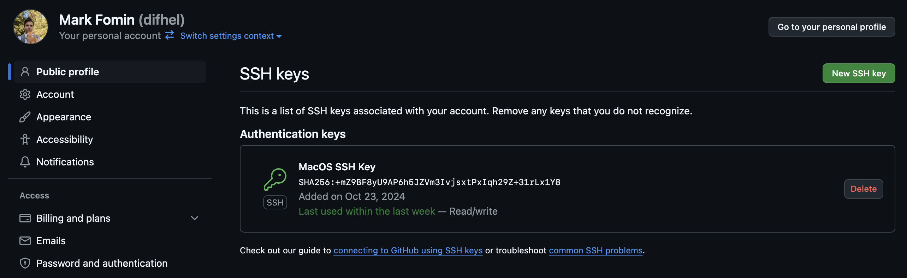
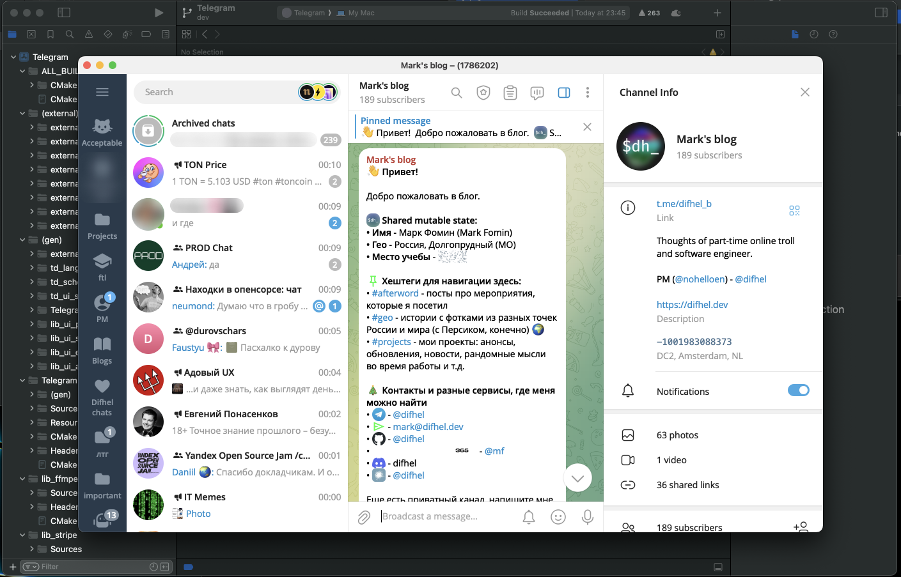

<!-- truncate -->
This is a short guide on how to avoid Git errors when cloning large repositories and build Telegram Desktop for Mac OS faster than in the official guide.

## Why not just follow the official guide?
Well, you can precisely follow it — [here is the link](https://github.com/telegramdesktop/tdesktop/blob/dev/docs/building-mac.md) — but you will encounter these two problems:

1. `git` will crash when cloning one of the submodules or third-party libraries required for Telegram Desktop because of an issue with HTTP cloning of large repositories. You might see an error message like this:

<figure>

<figcaption><center>Git crashes when cloning a large repository via HTTP</center></figcaption>
</figure>

2. The preparation script is veeeeery slow.

Here's how to avoid these issues.

## Fix cloning large repositories crash

On StackOverflow, you can find some solutions, such as forcing Git to use `HTTP/1.1` instead of `HTTP/2` and increasing the `postBuffer` size, but these do not work. The only working solution is **to switch from `HTTP` to `SSH` cloning**.

First, we should check if we already have a pair of SSH keys or need to create a new one.
```bash
ls -al ~/.ssh
```
If the folder is empty, you must create a new SSH key:
```bash
ssh-keygen -t ed25519 -C "your_email@example.com"
```

Now we should add some SSH configuration for `github.com`. Open the file in your favorite editor, for example:
```bash
nano ~/.ssh/config
```

And put the following content into the file:

```bash title="~/.ssh/config"
Host github.com
  AddKeysToAgent yes
  UseKeychain yes
  IdentityFile ~/.ssh/id_ed25519
```

After that, the client configuration is complete, and we should add the SSH public key to GitHub.

Go to [https://github.com/settings/keys](https://github.com/settings/keys), click on "New SSH key," and paste the content of `~/.ssh/id_ed25519.pub`.

<figure>

<figcaption><center>SSH Keys on GitHub</center></figcaption>
</figure>

Now you are ready to clone repositories from GitHub using `SSH`.

## Process of Building Telegram Desktop
1. Run `git clone git@github.com:telegramdesktop/tdesktop tdesktop`
:::warning
Note that we removed `--recursive` from the official guide and changed HTTP cloning to SSH.
:::

2. Open the `.gitmodules` file and replace all occurrences of `https://github.com/` with `git@github.com:`.

import { Carousel } from './../../src/components/Carousel';
import slide1 from './git-modules-1.png';
import slide2 from './git-modules-2.png';
import 'react-slideshow-image/dist/styles.css'

<Carousel slideImages ={[
  {
    url: slide1,
    caption: '1/2 Find all occurrences'
  },
  {
    url: slide2,
    caption: '2/2 ...and replace them'
  },
]}/>

3. Run `git submodule init && git submodule sync && git submodule update --depth 1`

4. After all submodules are cloned, you need to run the preparation script (`tdesktop/Telegram/build/prepare/prepare.py`). But before that, you might want to patch it to ensure fast and problem-free third-party library compilation.
    - First, you need to apply [this patch](https://github.com/telegramdesktop/tdesktop/commit/5e7791e3b7c69bdf16ac343b75793b75bc007662) to significantly speed up the library cloning process. This allows us to clone only one commit, not the entire library Git index.
    - Second, you need to replace all occurrences of `https://github.com/` with `git@github.com:` (to fix the Git issue we discussed above).

5. Run `./tdesktop/Telegram/build/prepare/mac.sh`

6. Switch to the `tdesktop/Telegram` folder and run `./configure.sh -D TDESKTOP_API_ID=some_id -D TDESKTOP_API_HASH=some_hash`. API credentials can be retrieved [here](https://my.telegram.org).

:::danger
Or you can use the official ones at your own risk (it's against the ToS): `./configure.sh -D TDESKTOP_API_ID=2040 -D TDESKTOP_API_HASH=b18441a1ff607e10a989891a5462e627`
:::

7. Open the `tdesktop/out/Telegram.xcodeproj` file in Xcode.

8. Select the `Telegram` scheme, then click on "Edit scheme" and change the build configuration to "Release".

import slide3 from './xcode-1.png';
import slide4 from './xcode-2.png';
import slide5 from './xcode-3.png';

<Carousel slideImages ={[
  {
    url: slide3,
    caption: '1/3 Select "Telegram" build scheme'
  },
  {
    url: slide4,
    caption: '2/3 In the bottom of the menu click on "Edit scheme"'
  },
  {
    url: slide5,
    caption: '3/3 Switch from "Debug" to "Release"'
  },
]}/>

9. Select **Product > Build For > Running**

10. Move `tdesktop/out/Release/Telegram.dmg` to `~/Applications`

**That's it!**


