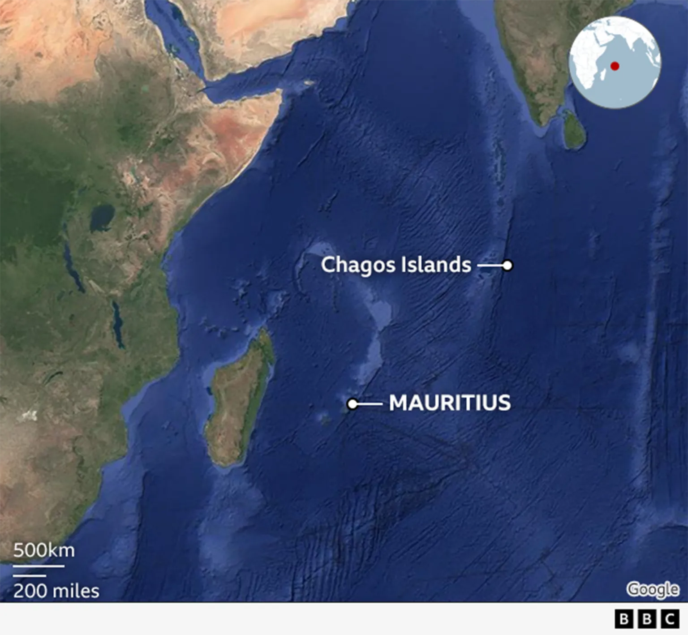

<!-- truncate -->
3 октября британское правительство [объявило](https://www.bbc.co.uk/news/articles/c98ynejg4l5o), что отказывается от суверенитета над небольшими островами Чагос в Индийском океане. Острова будут переданы соседнему островному государству Маврикий. Исторический контекст: правительство Маврикия давно утверждает, что его незаконно заставили отдать острова Чагос в обмен на независимость от Великобритании в 1968 году, и теперь архипелаг возвращается назад.

Эта история не была достаточно освещена в технических СМИ, хотя стоило бы, ведь решение передать острова новому владельцу приведет к потере одной из самых лакомых доменных зон верхнего уровня в  IT-индустрии: .io.

.io постоянно на слуху: будь то [github.io](https://github.io) (сайт Github Pages), сайт инди-игр [itch.io](https://itch.io) или конференция [Google I/O](https://io.google) (которая, возможно, и задала тренд на .io в далеком 2008 году).

Частично эта сверхпопулярность .io в IT-секторе объясняется тем, что IO представляет собой аббревиатуру для «input/output». Однако мало кому известно, что формально .io это национальный домен верхнего уровня ([ccTLD](https://en.wikipedia.org/wiki/Country_code_top-level_domain)).

<figure>

<figcaption>
Острова Чагос
</figcaption>
</figure>

Правительство Маврикия долгое время утверждало, что британцы незаконно сохранили контроль над архипелагом, когда Маврикий обрел независимость. Потребовалось более 50 лет, чтобы разрешить этот спор, и наконец стороны почти пришли к заключению договора. В обмен на 99-летнюю аренду военной базы острова Чагос станут частью Маврикия.

Национальный домен верхнего уровня .io выдан для Британской территории в Индийском океане (British Indian Ocean Territory). После подписания этого договора Британская территория в Индийском океане прекратит свое существование. После этого ISO удалит код страны «IO» из [спецификации](https://en.wikipedia.org/wiki/ISO_3166-1_alpha-2#IO).

Управление по распределению номеров в Интернете (IANA, часть ICANN), которое управляет доменами верхнего уровня, использует спецификацию ISO-3166 для определения того, какие национальные домены верхнего уровня должны существовать. Согласно [правилам ccTLD](https://www.iana.org/help/cctld-retirement), указанным на сайте IANA, после исключения IO из спецификации управление уведомит владельца зоны, после чего закроет регистрацию новых доменов. Также автоматически начнется процесс прекращения действия существующих - полностью процесс завершится в течение срока от 5 до 10 лет, в случае если было запрошено продление периода "мягкого" удаления ccTLD.

Официально .io — и бесчисленное множество веб-сайтов — исчезнут. Или нет?

## Получается, все .io сайты исчезнут?
Несмотря на то, что удаление целой страны или территории с карты мира происходит невероятно редко, такие прецеденты уже происходили.

19 сентября 1990 года IANA создала национальный домен верхнего уровня .su для СССР. Меньше чем через год СССР распался. В то время никто не думал о том, что должно произойти с доменом .su, поэтому домен .su был передан России вместе с ее собственным .ru. Было обговорено, что .su в конечном итоге будет закрыт, но четких правил его упразднения или того, когда это должно произойти, не было определено. В результате сайты на .su все еще доступны, и кто угодно может зарегистрировать новый домен.

Похожая ситуация произошла после распада Югославии.

Когда в 2006 году Черногория объявила о своей независимости от Сербии, IANA была полна решимости не допустить повторного правления хаоса. Поэтому были созданы два новых национальных домена верхнего уровня: .rs для Сербии и .me для Черногории с требованием, чтобы зона .yu была официально закрыта. Это произошло в 2010 году, и, в отличие от случая с .su, здесь IANA в конечном итоге добилась своего.

После этих случаев организация установила новый, более строгий набор правил и сроков действия доменов верхнего уровня, которые существуют и сегодня, и, скорее всего, будут применены к .io.

Значит ли это, что IANA будет действовать строго согласно установленным правилам, чтобы избежать того, что было в прошлые разы с закрытием ccTLD? Не факт, все-таки всем понятно, что основная доля .io доменов никак не связана географически с архипелагом, а принадлежит различным техническим сайтам, которые довольно важны для интернета. Так что в теории IANA может подтасовать свои собственные правила и позволить .io продолжить существовать.

Нам остается лишь следить за развитием событий.

В любом случае думаю, что в эпоху, когда домены могут стоить миллионы долларов, эта история - полезное напоминание о том, что существуют силы за пределами интернета, которые могут влиять на нашу цифровую жизнь.
