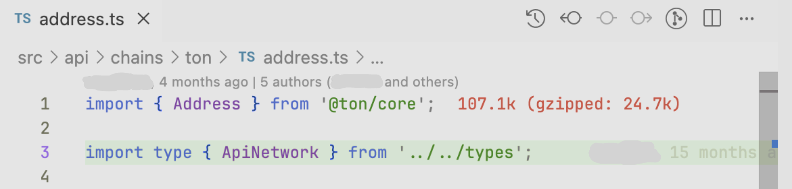
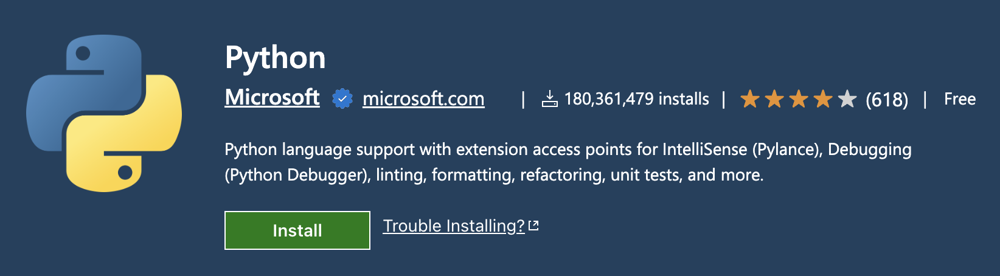
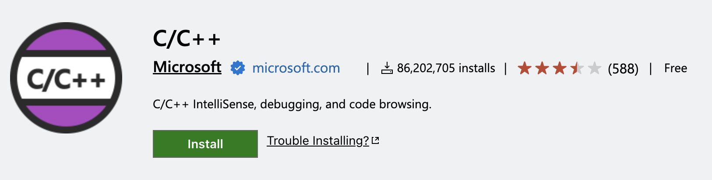

<!-- truncate -->

## Intro
There is growing interest in switching to VSCode as a primary IDE, as it is open-source, lightweight, and extensible compared to the bloated IDEs from JetBrains.

Moreover, the popularity of AI tools such as Cursor (VS Code–based) also adds a reason to learn how to build useful workflows in VS Code–based apps.

By the way, JetBrains' products also cannot be used in some countries due to sanctions—because, of course, users are always held responsible for the actions of their governments 🤡, and JetBrains, [a company founded in Russia](https://en.wikipedia.org/wiki/JetBrains), instead of formally complying with software export rules, makes every effort to prevent developers from using their products—detecting VPNs, revoking licenses, and ultimately forcing Russian developers to resort to unverified pirated copies or switch to other tools.

I've been using VS Code primarily for over 6 years now and I want to share my top extensions that I use in my work.

Spoiler: there won't be any crazy recipes with maximum customization here, VSCode is not neovim 😁

Just the basic extensions for work. For each extension I wrote why I use it. Of course, these extensions can do much more; I just highlight my main pain points in VS Code, which are solved by these extensions. Let's go!
## Web Development Extensions

### React CSS Modules

**Install:** https://marketplace.visualstudio.com/items?itemName=viijay-kr.react-ts-css

**Why:** For some reason, TypeScript declarations for CSS modules interfere with the source code, preventing Cmd+Click from working on classnames like this:
```tsx
<div className={styles.banana}>Alas</div>
```
There is also a discussion on GitHub: [https://github.com/vitejs/vite/discussions/5444](https://github.com/vitejs/vite/discussions/5444)


### Auto Rename Tags

**Install:** https://marketplace.visualstudio.com/items?itemName=formulahendry.auto-rename-tag

**Why:** Easily rename closing tags while editing the opening tag.

import autoRenameTagsDemo from './auto-rename-tags-demo.mov';

<video
  autoPlay
  muted
  loop
  width="100%"
  src={autoRenameTagsDemo}
/>

### ESLint

**Install:** https://marketplace.visualstudio.com/items?itemName=dbaeumer.vscode-eslint

**Why:** See linter warnings for your JavaScript and TypeScript code directly in the IDE, blazingly fast.


### Import Cost

**Install:** https://marketplace.visualstudio.com/items?itemName=wix.vscode-import-cost

**Why:** Shows the impact on bundle size from imports.


### JavaScript and TypeScript Nightly

**Install:** https://marketplace.visualstudio.com/items?itemName=ms-vscode.vscode-typescript-next

**Why:** I often use the newest TypeScript features in my projects, but the built-in version lags behind.

### Path Intellisense

**Install:** https://marketplace.visualstudio.com/items?itemName=christian-kohler.path-intellisense

**Why:** Improved path autocompletion.

### SCSS Formatter

**Install:** https://marketplace.visualstudio.com/items?itemName=sibiraj-s.vscode-scss-formatter

**Why:** A nice SCSS/CSS formatter powered by Prettier.

### SCSS IntelliSense

**Install:** https://marketplace.visualstudio.com/items?itemName=mrmlnc.vscode-scss

**Why:** Autocomplete for SCSS variables, mixins, and functions.

### Prisma

**Install:** https://marketplace.visualstudio.com/items?itemName=Prisma.prisma

**Why:** Syntax highlighting for `.prisma` files, used by Prisma ORM.

## Git and Version Control Extensions

### Git History

**Install:** https://marketplace.visualstudio.com/items?itemName=donjayamanne.githistory

**Why:** View line history to quickly identify who to contact regarding the code you're working on.


### GitHub Pull Requests

**Install:** https://marketplace.visualstudio.com/items?itemName=GitHub.vscode-pull-request-github

**Why:** Quickly create pull requests from branches and view code review comments directly in the IDE.


### GitLens — Git supercharged

**Install:** https://marketplace.visualstudio.com/items?itemName=eamodio.gitlens

**Why:** Extended Git support in VS Code.

## Productivity and Utility Extensions

### CodeSnap

**Install:** https://marketplace.visualstudio.com/items?itemName=adpyke.codesnap

**Why:** Quickly save screenshots of your code.


### Peacock

**Install:** https://marketplace.visualstudio.com/items?itemName=johnpapa.vscode-peacock

**Why:** Easily manage multiple VS Code windows by coloring the title bars differently for each project.


### Code Spell Checker

**Install:** https://marketplace.visualstudio.com/items?itemName=streetsidesoftware.code-spell-checker

**Why:** Finds misspellings and errors in your text, variable names, etc. Also supports additional languages (e.g., Russian) as add-ons.

### svgo

**Install:** https://marketplace.visualstudio.com/items?itemName=1000ch.svgo

**Why:** Easily optimize SVGs directly in the IDE.


## File and Data Handling Extensions

### Docker

**Install:** https://marketplace.visualstudio.com/items?itemName=ms-azuretools.vscode-docker

**Why:** Syntax highlighting for Dockerfiles.

### Rainbow CSV

**Install:** https://marketplace.visualstudio.com/items?itemName=mechatroner.rainbow-csv

**Why:** Highlights columns in CSV files for better readability.


### SQLite Viewer

**Install:** https://marketplace.visualstudio.com/items?itemName=qwtel.sqlite-viewer

**Why:** A quick and easy SQLite viewer.


## Python Development Extensions

### Python

**Install:** https://marketplace.visualstudio.com/items?itemName=ms-python.python

**Why:** Python support for VS Code.

### Python Debugger

**Install:** https://marketplace.visualstudio.com/items?itemName=ms-python.debugpy

**Why:** Advanced Python debugger.

### Pylance

**Install:** https://marketplace.visualstudio.com/items?itemName=ms-python.vscode-pylance

**Why:** Supercharges your Python IntelliSense with rich type information.

## C/C++ and Build Tool Extensions

### CMake

**Install:** https://marketplace.visualstudio.com/items?itemName=twxs.cmake

**Why:** Basic support for CMake files.

### CMake Tools

**Install:** https://marketplace.visualstudio.com/items?itemName=ms-vscode.cmake-tools

**Why:** Advanced support for CMake: run your CMake projects from the UI.

### clangd

**Install:** https://marketplace.visualstudio.com/items?itemName=llvm-vs-code-extensions.vscode-clangd

**Why:** Advanced code completion and language support for C/C++. I recommend using clang instead of gcc for its better stability and frequent updates. clangd is the language server that comes with clang, and this extension enables it in VS Code.

### C/C++

**Install:** https://marketplace.visualstudio.com/items?itemName=ms-vscode.cpptools

**Why:** Basic support for C/C++ languages, including IntelliSense.

### C/C++ Themes

**Install:** https://marketplace.visualstudio.com/items?itemName=ms-vscode.cpptools-themes

**Why:** Better semantic colorization instead of just the default syntactic/lexical-based one.

---
That’s all for now. Feel free to share other extensions you find useful in the comments.
